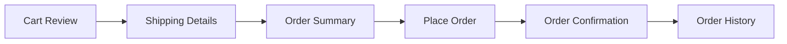
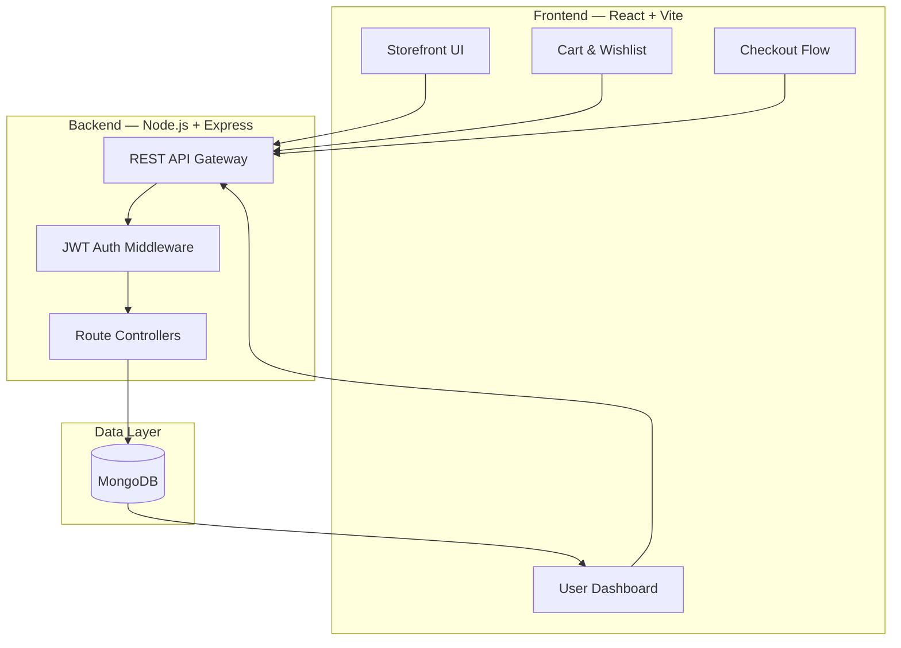
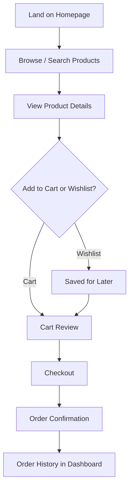
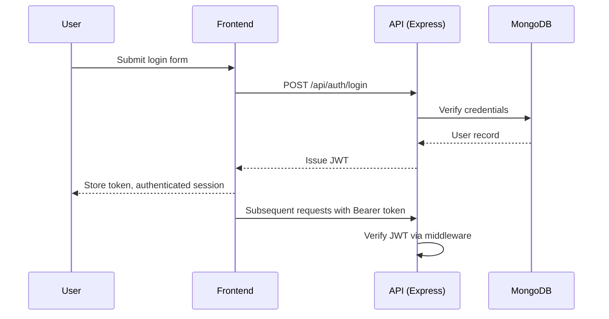

<div align="center">


<br/>

[](https://git.io/typing-svg)

<br/>

> **Note:** *ElectroHub* is a placeholder name used for this README. If an official project name is chosen later, every reference below is a simple find-and-replace.

<br/>

<p>
  
  
  
  
</p>
<p>
  
  
  
  
</p>
<p>
  
  
  
  
</p>
<p>
  
  
  
  
</p>

<br/>

<a href="#"></a>
&nbsp;
<a href="https://github.com/TheNameIsBhagavan"></a>
&nbsp;
<a href="https://thenameisbhagavan.vercel.app/"></a>

</div>

<br/>

<!-- Replace with ElectroHub Homepage Hero Screenshot -->

<div align="center">
  <p><i>Electronics shopping, built the way a modern storefront should feel.</i></p>
</div>

<br/>

---

## Table of Contents

<details>
<summary><b>Click to expand full contents</b></summary>

- [Introduction](#introduction)
- [Vision](#vision)
- [Mission](#mission)
- [Why ElectroHub](#why-electrohub)
- [Problem Statement](#problem-statement)
- [Solution](#solution)
- [Key Highlights](#key-highlights)
- [Platform Features](#platform-features)
- [Homepage Overview](#homepage-overview)
- [Product Discovery](#product-discovery)
- [Shopping Experience](#shopping-experience)
- [Product Details](#product-details)
- [Cart Management](#cart-management)
- [Wishlist](#wishlist)
- [Checkout Flow](#checkout-flow)
- [User Dashboard](#user-dashboard)
- [Responsive Design](#responsive-design)
- [Performance](#performance)
- [Security](#security)
- [Complete Architecture](#complete-architecture)
- [User Flow Diagram](#user-flow-diagram)
- [Technology Stack](#technology-stack)
- [Folder Structure](#folder-structure)
- [Project Modules](#project-modules)
- [Component Architecture](#component-architecture)
- [Installation](#installation)
- [Quick Start](#quick-start)
- [Local Development](#local-development)
- [Environment Variables](#environment-variables)
- [API Overview](#api-overview)
- [Authentication Flow](#authentication-flow)
- [Deployment Guide](#deployment-guide)
- [Screenshots](#screenshots)
- [Development Workflow](#development-workflow)
- [Coding Standards](#coding-standards)
- [UI Design Philosophy](#ui-design-philosophy)
- [Engineering Philosophy](#engineering-philosophy)
- [Performance Optimization](#performance-optimization)
- [Accessibility](#accessibility)
- [SEO Considerations](#seo-considerations)
- [Future Roadmap](#future-roadmap)
- [Lessons Learned](#lessons-learned)
- [Known Limitations](#known-limitations)
- [Contribution Guide](#contribution-guide)
- [License](#license)
- [Acknowledgements](#acknowledgements)
- [Author](#author)
- [Connect With Me](#connect-with-me)

</details>

---

## Introduction

**ElectroHub** is a modern e-commerce platform built to let users discover, compare, and purchase electronic products through a clean, responsive, and intuitive shopping experience — built end-to-end on the MERN stack over the course of a hackathon.

It isn't a template checkout page with product cards pasted in. It's a full shopping experience — discovery, filtering, cart, wishlist, checkout, and account management — built with the same architectural discipline as a production storefront.

---

## Vision

To prove that a hackathon timeline doesn't have to mean a hackathon-quality result — that a small, focused team (or a single engineer) can ship a storefront that feels like it belongs to a real electronics retailer.

---

## Mission

ElectroHub's mission is to make electronics shopping fast, clear, and frictionless — from the first product search to the final checkout confirmation — while staying fully responsive across devices and performant under real usage.

---

## Why ElectroHub

E-commerce is one of the most unforgiving categories to build for. Users have been trained by Amazon, Best Buy, and Flipkart to expect instant search, clear filtering, and a checkout flow with zero friction. Anything short of that reads as broken, not "in progress."

ElectroHub was built to hit that bar within a hackathon timeframe — treating product discovery, cart state, and checkout as the core engineering problems they actually are, rather than an afterthought behind a nice landing page.

---

## Problem Statement

- Many hackathon e-commerce projects nail the landing page and neglect cart/checkout state management
- Product discovery (search, filter, sort) is often the weakest part of quickly-built storefronts
- Responsive design frequently breaks down specifically in cart and checkout flows, where layout complexity is highest
- Authentication and order history are commonly skipped entirely under time pressure

---

## Solution

ElectroHub treats cart and wishlist state as first-class, persisted application state — not component-local state that disappears on refresh — and applies the same responsive design discipline to checkout as to the homepage. Authentication and order history are built in from the start rather than bolted on later.

---

## Key Highlights

- Full shopping flow: discovery → product detail → cart → checkout → order history
- Persisted cart and wishlist state via authenticated user sessions
- Filtering and sorting built as real query logic, not client-side array tricks on a static list
- JWT-based authentication protecting user-specific data (cart, wishlist, orders, profile)
- Fully responsive across desktop, tablet, and mobile, including the checkout flow

---

## Platform Features

<table>
<tr>
<td width="50%">

**Beautiful Landing Page**
Hero section, featured products, and offers surfaced above the fold.

**Product Listing & Categories**
Browsable catalog organized by category with consistent card layouts.

**Product Search**
Fast, query-driven search across the product catalog.

**Product Filtering & Sorting**
Filter by category, price range, and rating; sort by relevance, price, or newest.

**Product Details**
Full product view with specifications, images, and customer reviews.

**Customer Reviews & Ratings**
User-submitted reviews with star ratings displayed on product pages.

</td>
<td width="50%">

**Shopping Cart**
Persisted cart state tied to the authenticated user, not just local component state.

**Wishlist**
Save products for later without adding them to the active cart.

**Checkout UI**
Order summary, shipping details, and a clear multi-step checkout flow.

**User Authentication**
JWT-based login and signup protecting user-specific routes and data.

**Profile Dashboard & Order History**
Authenticated view of past orders and account details.

**Dark Mode**
Full dark theme applied consistently across every page, including checkout.

</td>
</tr>
</table>

**Featured Products · Discount Section · Offers · Contact Page · FAQ**
— surfaced on the homepage and covered further in [Homepage Overview](#homepage-overview).

---

## Homepage Overview

The homepage is structured around a clear hierarchy: hero banner, featured products, category navigation, active offers/discounts, and a footer with contact and FAQ links. Each section is a standalone component, so the homepage composition can be reordered without touching the underlying feature logic.

---

## Product Discovery

Search, filtering, and sorting are implemented as real backend query parameters rather than client-side filtering of a fully-loaded product list — this keeps the catalog responsive even as the number of products grows, and means discovery logic isn't duplicated between frontend and backend.

---

## Shopping Experience

From product listing to product detail to cart, the shopping experience is designed to minimize the number of clicks between "interested" and "in cart." Product cards surface the information a shopper actually compares — price, rating, and availability — without requiring a click-through for basic decisions.

---

## Product Details

The product detail page includes full specifications, an image gallery, pricing (including any active discount), and customer reviews with star ratings — everything needed to make a purchase decision without leaving the page.

---

## Cart Management

Cart state is persisted server-side per authenticated user, so a cart survives a page refresh or a new session on a different device. Quantity updates and item removal are reflected immediately in both the UI and the persisted state.

---

## Wishlist

The wishlist is a separate persisted list from the cart, letting users save products they're considering without committing them to a purchase flow. Items can be moved from wishlist to cart in a single action.

---

## Checkout Flow

Checkout is broken into clear steps — order summary, shipping details, and confirmation — with cart contents and pricing totals remaining visible throughout, rather than hidden behind a single opaque "place order" button.



---

## User Dashboard

The profile dashboard gives authenticated users a single place to view account details and order history, without needing to dig through email confirmations to track a past purchase.

---

## Responsive Design

Every major flow — homepage, product listing, product detail, cart, and checkout — is designed per breakpoint rather than simply scaled down for smaller screens. Checkout specifically was treated as a first-class responsive design target, since it's the flow most commonly broken on mobile in fast-built e-commerce projects.

---

## Performance

- Vite-powered frontend build for fast development and optimized production bundles
- Product queries (search, filter, sort) handled server-side to avoid over-fetching the full catalog
- Lazy-loaded product images across listing and detail pages

---

## Security

- JWT-based authentication protecting cart, wishlist, orders, and profile routes
- Passwords hashed before storage, never stored or transmitted in plain text
- Environment-based configuration keeps database and JWT secrets out of source control

---

## Complete Architecture



---

## User Flow Diagram



---

## Technology Stack

<div align="center">

### Frontend

| Technology | Purpose |
|---|---|
|  | Component-based storefront UI |
|  | Build tooling and dev server |
|  | Application logic |
|  | Markup structure |
|  | Styling and responsive layout |

### Backend

| Technology | Purpose |
|---|---|
|  | JavaScript runtime |
|  | REST API framework |
|  | Authentication and session tokens |

### Database & Deployment

| Technology | Purpose |
|---|---|
|  | Product, user, cart, and order data |
|  | Frontend deployment |
|  | Backend API deployment |
|   | Version control |

</div>

---

## Folder Structure

```
electrohub/
├── client/
│   ├── public/
│   ├── src/
│   │   ├── components/
│   │   │   ├── ui/
│   │   │   ├── product/
│   │   │   ├── cart/
│   │   │   └── layout/
│   │   ├── pages/
│   │   │   ├── Home.jsx
│   │   │   ├── ProductListing.jsx
│   │   │   ├── ProductDetail.jsx
│   │   │   ├── Cart.jsx
│   │   │   ├── Wishlist.jsx
│   │   │   ├── Checkout.jsx
│   │   │   └── Dashboard.jsx
│   │   ├── hooks/
│   │   ├── services/
│   │   │   └── api.js
│   │   ├── context/
│   │   │   └── CartContext.jsx
│   │   ├── App.jsx
│   │   └── main.jsx
│   ├── vite.config.js
│   └── package.json
├── server/
│   ├── controllers/
│   │   ├── productController.js
│   │   ├── cartController.js
│   │   ├── orderController.js
│   │   └── authController.js
│   ├── routes/
│   │   ├── products.js
│   │   ├── cart.js
│   │   ├── orders.js
│   │   └── auth.js
│   ├── models/
│   │   ├── Product.js
│   │   ├── User.js
│   │   ├── Cart.js
│   │   └── Order.js
│   ├── middleware/
│   │   └── authMiddleware.js
│   ├── config/
│   │   └── db.js
│   ├── server.js
│   ├── package.json
│   └── .env.example
├── .gitignore
└── README.md
```

---

## Project Modules

| Module | Responsibility |
|---|---|
| Product Module | Catalog listing, search, filtering, sorting, and product detail retrieval |
| Cart Module | Add/remove/update cart items, persisted per authenticated user |
| Wishlist Module | Save/remove products for later without affecting cart state |
| Checkout Module | Order summary, shipping details, and order placement |
| Auth Module | Signup, login, JWT issuance, and route protection |
| Dashboard Module | Profile details and order history retrieval |

---

## Component Architecture

The frontend follows a page-and-component split: pages own layout and data-fetching, while reusable components (product cards, buttons, badges) stay presentation-only and receive data via props. Cart and wishlist state is managed through React context, so any component in the tree can read or update it without prop drilling.

---

## Installation

### Prerequisites

- Node.js 18+
- MongoDB (local instance or Atlas connection string)

### Clone the Repository

```bash
git clone https://github.com/TheNameIsBhagavan/electrohub.git
cd electrohub
```

---

## Quick Start

```bash
# Install frontend dependencies
cd client
npm install

# Install backend dependencies
cd ../server
npm install
```

---

## Local Development

```bash
# Start the backend (from /server)
npm run dev

# Start the frontend (from /client)
npm run dev
```

The frontend runs at `http://localhost:5173` and the API at `http://localhost:5000` by default.

---

## Environment Variables

| Variable | Description |
|---|---|
| `MONGODB_URI` | MongoDB connection string |
| `JWT_SECRET` | Secret used to sign authentication tokens |
| `PORT` | Port for the Express server |
| `CLIENT_ORIGIN` | Allowed origin for CORS configuration |

---

## API Overview

<details>
<summary><b>Click to expand endpoint reference</b></summary>

| Method | Endpoint | Description |
|---|---|---|
| `GET` | `/api/products` | List products with optional search, filter, and sort query params |
| `GET` | `/api/products/:id` | Retrieve a single product's details |
| `POST` | `/api/auth/signup` | Register a new user |
| `POST` | `/api/auth/login` | Authenticate a user and issue a JWT |
| `GET` | `/api/cart` | Retrieve the current user's cart |
| `POST` | `/api/cart` | Add or update an item in the cart |
| `DELETE` | `/api/cart/:productId` | Remove an item from the cart |
| `GET` | `/api/wishlist` | Retrieve the current user's wishlist |
| `POST` | `/api/orders` | Place an order from the current cart |
| `GET` | `/api/orders` | Retrieve the current user's order history |

</details>

---

## Authentication Flow



---

## Deployment Guide

ElectroHub deploys with a split architecture: the React frontend on **Vercel** and the Express backend on **Render**.

- Frontend: connect the `client/` directory to Vercel using the standard Vite build command (`npm run build`)
- Backend: deploy `server/` to Render as a Node web service, with environment variables configured through the Render dashboard
- Database: use a managed MongoDB Atlas cluster for production rather than a local instance

---

## Screenshots

<div align="center">

### Homepage
<!-- Replace with Homepage Screenshot -->

### Product Listing
<!-- Replace with Product Listing Screenshot -->

### Product Detail
<!-- Replace with Product Detail Screenshot -->

### Cart
<!-- Replace with Cart Screenshot -->

### Checkout
<!-- Replace with Checkout Screenshot -->

### Dashboard
<!-- Replace with Dashboard Screenshot -->

</div>

<!-- Replace with Shopping Flow Demo GIF -->

---

## Development Workflow

- Feature branches per module (cart, checkout, auth, etc.), merged through pull requests
- Frontend and backend developed and run independently during local development, connected via the REST API
- Cart and checkout flows tested manually across breakpoints before merging, given how easily they break on smaller screens

---

## Coding Standards

- Controllers stay focused on request/response handling; data logic lives in models and services
- Consistent naming between frontend API calls and backend route paths
- Cart and wishlist state changes always go through the context layer, never mutated directly in components
- No hardcoded credentials or environment-specific values — everything routes through configuration

---

## UI Design Philosophy

ElectroHub's interface borrows a simple rule from the retailers that do this best: get out of the way of the purchase decision. Product cards surface exactly what a shopper compares — price, rating, availability — and the checkout flow keeps totals visible at every step instead of hiding them until the end.

---

## Engineering Philosophy

Hackathon timelines create pressure to fake the hard parts — state management, auth, checkout — behind a polished landing page. ElectroHub was built against that instinct: the landing page came last, and cart/checkout state management came first, because those are the parts that actually determine whether the platform works.

---

## Performance Optimization

- Server-side filtering and sorting to avoid shipping the full product catalog to the client
- Lazy-loaded product images across listing and detail views
- Vite's optimized production build for fast page loads

---

## Accessibility

- Semantic HTML structure across product listings, cart, and checkout
- Sufficient color contrast in both light and dark mode
- Keyboard-navigable cart and checkout flows

---

## SEO Considerations

- Descriptive page titles and meta descriptions per product and category page
- Semantic heading structure for product listings and detail pages
- Clean, readable URL structure for product and category routes

---

## Future Roadmap

- [ ] Payment gateway integration for real checkout completion
- [ ] Admin dashboard for product and inventory management
- [ ] Product recommendation engine based on browsing history
- [ ] Order tracking with real-time status updates
- [ ] Multi-currency and multi-language support

---

## Lessons Learned

Building ElectroHub under a hackathon timeline reinforced how much cart and checkout state management determines whether an e-commerce project actually works, versus just looking like it works in a demo. Getting persisted, authenticated cart state right early made every feature built after it — wishlist, checkout, order history — significantly easier to implement correctly.

Treating filtering and sorting as backend query logic from the start, rather than a client-side shortcut, also paid off — it meant the catalog stayed fast and correct even as more products and filter combinations were added under time pressure.

---

## Known Limitations

- Checkout currently ends at order confirmation; real payment gateway integration is not yet implemented
- Product recommendations are not yet personalized based on browsing or purchase history
- Admin-side inventory management is not yet built — products are currently managed directly in the database

---

## Contribution Guide

Contributions, issues, and feature requests are welcome.

1. **Fork** the repository
2. **Create** your feature branch (`git checkout -b feature/amazing-feature`)
3. **Commit** your changes (`git commit -m 'Add some amazing feature'`)
4. **Push** to the branch (`git push origin feature/amazing-feature`)
5. **Open** a Pull Request

Please keep pull requests scoped to a single module (cart, checkout, auth, etc.) where possible, consistent with the [Project Modules](#project-modules) breakdown.

---

## License

This project is licensed under the **MIT License**.

```
MIT License

Copyright (c) 2026 Siva Satya Sai Bhagavan

Permission is hereby granted, free of charge, to any person obtaining a copy
of this software and associated documentation files, to deal in the Software
without restriction, including without limitation the rights to use, copy,
modify, merge, publish, distribute, sublicense, and/or sell copies of the
Software, subject to the following conditions: the above copyright notice
and this permission notice shall be included in all copies or substantial
portions of the Software.
```

See the [LICENSE](LICENSE) file for full details.

---

## Acknowledgements

ElectroHub was designed and built independently as a hackathon project, drawing on general best practices from the MERN stack and open-source e-commerce engineering patterns.

---

## Author

<div align="center">

### **Siva Satya Sai Bhagavan**

*Full Stack Engineer · Frontend Engineer · Product Builder*

[](https://thenameisbhagavan.vercel.app/)
[](https://github.com/TheNameIsBhagavan)

</div>

---

## Connect With Me

<div align="center">

<a href="https://github.com/TheNameIsBhagavan"></a>
<br/><br/>
<a href="https://thenameisbhagavan.vercel.app/"></a>
<br/><br/>
<a href="#"></a>
<br/><br/>
<a href="#"></a>

</div>

---

<div align="center">

### A storefront should get out of the way of the sale.


**© 2026 ElectroHub — Siva Satya Sai Bhagavan**

</div>
